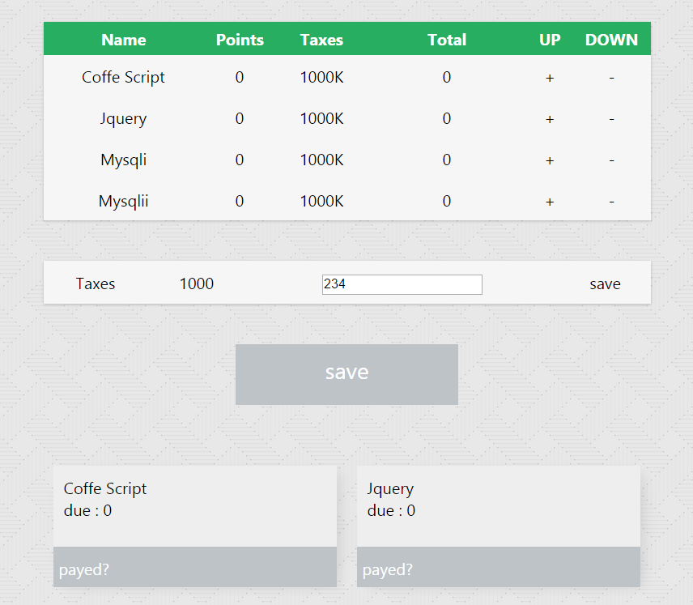

# counters
A html/css/js app to count things one by one

It has a simple logic with a stylesheets, js, and images folers.

It is possible to save the data into a local file but it needs a server logic for now.

## screenshots

