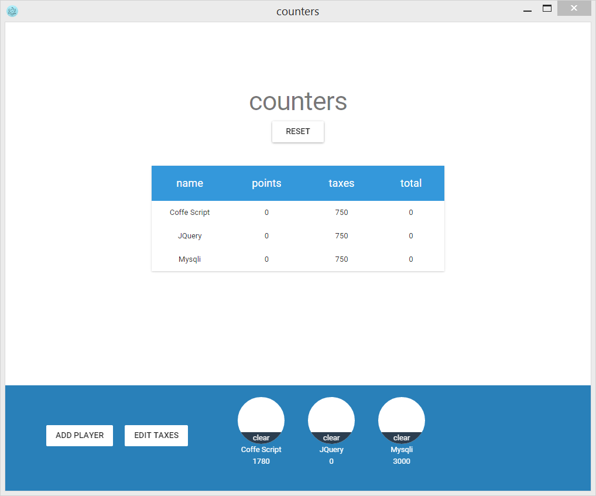

A tiny Reactjs app which count thing.
For test purposes.



## TOOLS

### [Material-UI](http://callemall.github.io/material-ui/)

This is a project that uses [Material-UI](http://callemall.github.io/material-ui/).

## Installation
After cloning the repository, install dependencies:
```
cd <project folder>/material-ui/example
npm install
```

Now you can run your local server:
```
npm start
```

# TIPS

* bind pour accéder aux props
* _sate_ pour automatiser les refresh
* modules (components) isolés en variables
* pas n'importe quel attr sur les composant react (voir https://facebook.github.io/react/docs/tags-and-attributes.html)
* _className_ pour définir des classes
* utilisation des _dialog_ modaux et _snackbars_
